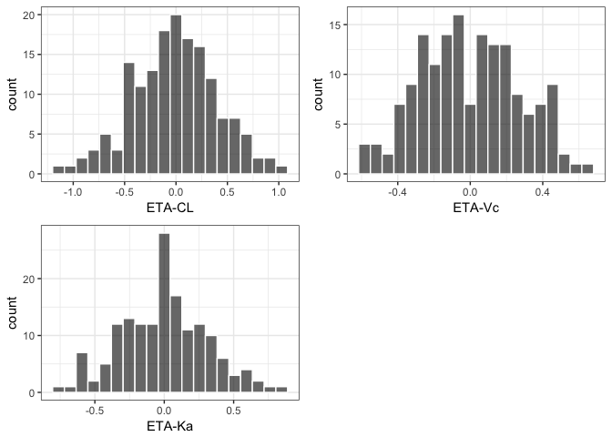
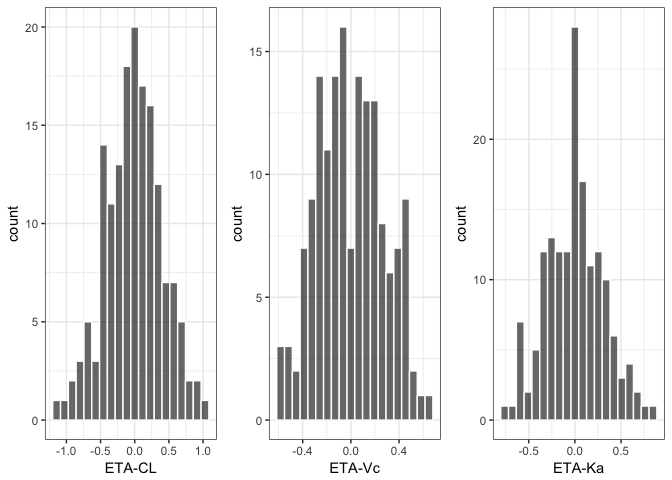
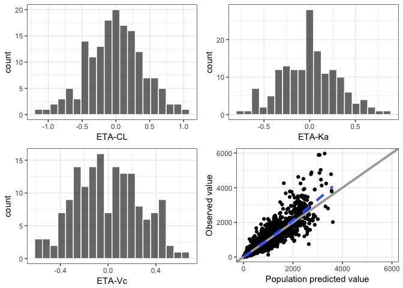
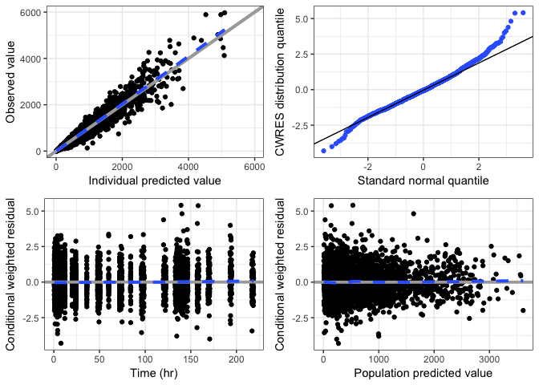
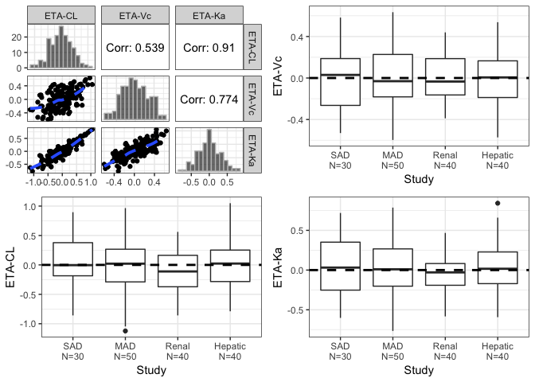
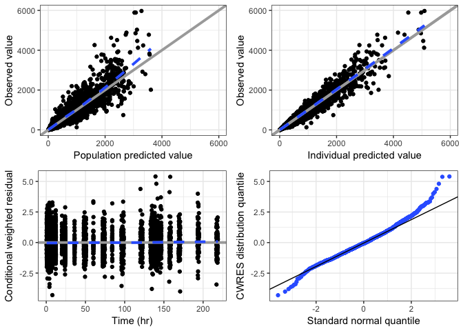
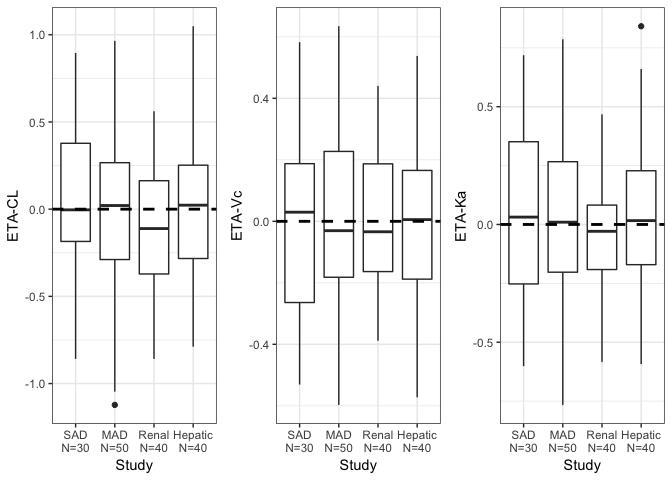
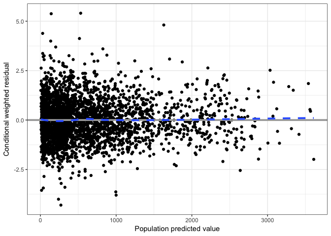
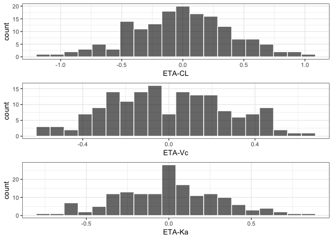

Planned changes / new features
================

-   [About](#about)
-   [Setup](#setup)
-   [Create some plots](#create-some-plots)
-   [Examples](#examples)
    -   [mrggpage puts plots into a grid](#mrggpage-puts-plots-into-a-grid)
    -   [Pipe the output to `mrggdraw` to see what it looks like](#pipe-the-output-to-mrggdraw-to-see-what-it-looks-like)
    -   [Control number of rows and columns](#control-number-of-rows-and-columns)
    -   [Distribute plots across several pages](#distribute-plots-across-several-pages)
-   [Get finer control of arrangement](#get-finer-control-of-arrangement)
-   [New stem and tag behavior](#new-stem-and-tag-behavior)
    -   [Previous behavior](#previous-behavior)
    -   [Stem is collapsed with `_`](#stem-is-collapsed-with-_)
    -   [tag is also collapsed](#tag-is-also-collapsed)
-   [Support for gtable and gList objects](#support-for-gtable-and-glist-objects)

About
=====

The next version will be `0.2.0`. The major changes are demonstrated here.

Setup
=====

``` r
library(mrggsave)
library(pmplots)
```

    ## Loading required package: ggplot2

``` r
library(dplyr)
```

    ## 
    ## Attaching package: 'dplyr'

    ## The following objects are masked from 'package:stats':
    ## 
    ##     filter, lag

    ## The following objects are masked from 'package:base':
    ## 
    ##     intersect, setdiff, setequal, union

``` r
data <- pmplots_data_obs()
ids <- distinct(data, ID, .keep_all = TRUE)
```

Create some plots
=================

``` r
etas <- c("ETA1//ETA-CL", "ETA2//ETA-Vc", "ETA3//ETA-Ka")

x <- eta_hist(ids, x = etas, bins = 20)

p1 <- dv_pred(data)
p2 <- dv_ipred(data)
p3 <- cwres_time(data)
p4 <- cwres_q(data)
p5 <- cwres_pred(data)
p6 <- eta_pairs(ids,etas)
```

    ## Loading required namespace: GGally

``` r
p7 <- eta_cat(ids, x = "STUDYc//Study", y = etas)
```

Make a list of plots to save out

``` r
px <- list(x,p1,p2,p3,p4,p5,p6,p7)
```

Examples
========

mrggpage puts plots into a grid
-------------------------------

``` r
mrggpage(x) 
```

    ## TableGrob (2 x 2) "arrange": 3 grobs
    ##   z     cells    name           grob
    ## 1 1 (1-1,1-1) arrange gtable[layout]
    ## 2 2 (1-1,2-2) arrange gtable[layout]
    ## 3 3 (2-2,1-1) arrange gtable[layout]

Pipe the output to `mrggdraw` to see what it looks like
-------------------------------------------------------

``` r
mrggpage(x) %>% mrggdraw()
```



Control number of rows and columns
----------------------------------

``` r
mrggpage(x, ncol = 3) %>% mrggdraw()
```



Distribute plots across several pages
-------------------------------------

This looks like one big grid of plots, but it is paginated so that it will create several pages when saved to pdf.

``` r
mrggpage(px, ncol = 2, nrow = 2, multiple = TRUE) %>% mrggdraw()
```



Get finer control of arrangement
================================

Instead of doing this

``` r
px <- list(x,p1,p2,p3,p4,p5,p6,p7)
```

try arranging the plots page by page as you want to arrange them

``` r
px2 <- list(
  mrggpage(x),
  mrggpage(p1,p2,p3,p4),
  mrggpage(p7,ncol = 3),
  p5
)

mrggdraw(px2)
```



New stem and tag behavior
=========================

Previous behavior
-----------------

``` r
a <- mrggsave(p1, script = "foo.R", stem = "myplot", dir = tempdir())

basename(a)
```

    ## [1] "myplot.pdf"

Stem is collapsed with `_`
--------------------------

Just pass in `stem` as a vector argument

``` r
runno <- 101
b <- mrggsave(p1, script = "foo.R", stem = c("myplot", runno), dir = tempdir())
basename(b)
```

    ## [1] "myplot_101.pdf"

tag is also collapsed
---------------------

``` r
c <- mrggsave(p1, script = "diagnostics.R", tag = c("dv_pred","run",runno), dir = tempdir())

basename(c)
```

    ## [1] "diagnostics_dv_pred_run_101.pdf"

Support for gtable and gList objects
====================================

-   Also added a `mrggsave.default` method to try an handle anything that might come through.

``` r
gt <- gridExtra::arrangeGrob(grobs=x)

gtable::is.gtable(gt)
```

    ## [1] TRUE

``` r
mrggdraw(gt)
```



``` r
d <- mrggsave(gt, script = "diagnostics.R", tag = "foo", dir = tempdir())

basename(d)
```

    ## [1] "diagnostics_foo.pdf"

-   Save a `gList` object

``` r
library(grid)

gr <- lapply(list(p1,p2,p3), ggplotGrob)

gl <- gList(gr[[1]], gr[[2]], gr[[3]])

class(gl)
```

    ## [1] "gList"

``` r
e <- mrggsave(gl, script = "diagnostics.R", stem = "foo", dir = tempdir())

basename(e)
```

    ## [1] "foo.pdf"
