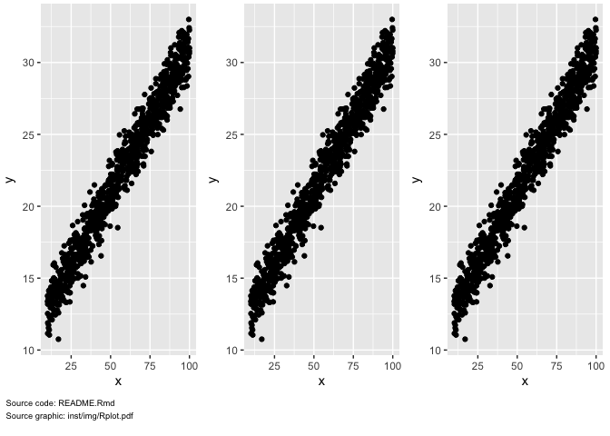

Setup
=====

``` r
library(mrggsave)
library(ggplot2)

dir <- "inst/img"
Script <- "README.Rmd"

x <- runif(1000, 10,100)
y <- 10 + 0.2*x + rnorm(length(x),1)
data <- data.frame(x = x, y = y)
```

Plots get drawn with annotations
================================

``` r
p <- ggplot(data = data, aes(x,y)) + geom_point()

mrggdraw(p, Script, "ggplot")
```


And save with annotation
------------------------

``` r
mrggsave(p, Script, "myggplot", width = 5, height = 4, dir = dir)
```

GGally - draw and save
======================

``` r
library(GGally)
p2 <- ggpairs(data)
mrggsave(p2, Script, "myggpairsplot", dir = dir)
```

The saved image
---------------

``` r
knitr::include_graphics("inst/img/myggpairsplot.pdf")
```

<embed src="inst/img/myggpairsplot.pdf" width="700" height="700" type="application/pdf" />
Arrange and save
================

``` r
mrggsave(list(p,p,p), Script,  "arranged", arrange = TRUE, ncol = 3, dir = dir)
```

The saved image
---------------

``` r
knitr::include_graphics("inst/img/arranged.pdf")
```

<embed src="inst/img/arranged.pdf" width="700" height="700" type="application/pdf" />
Arrange and save
----------------

``` r
mrggdraw(list(p,p,p), Script, arrange = TRUE, ncol = 3, save = TRUE, dir = dir)
```


