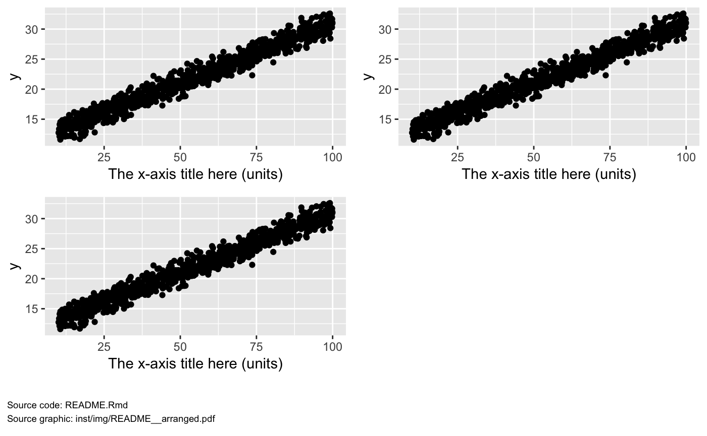

Setup
=====

``` r
library(mrggsave)
library(ggplot2)
```

Set the default image save directory to something local. The default is `../deliv/figure`.

``` r
options(mrggsave_dir = "inst/img")

Script <- "README.Rmd"
```

``` r
x <- runif(1000, 10,100)

y <- 10 + 0.2*x + rnorm(length(x),1)

data <- data.frame(x = x, y = y)
```

``` r
p <- ggplot(data = data, aes(x,y)) + 
  geom_point() +
  xlab("The x-axis title here (units)")
```

Plots get drawn with annotations
================================

``` r
mrggsave(p, Script, "_annotation", draw = TRUE)
```


The saved plot can be seen [here](inst/img/README_annotation.pdf).

GGally - draw and save
======================

``` r
library(GGally)

p2 <- ggpairs(data)

mrggsave(p2, Script, "_pairs", draw = TRUE)
```


The saved plot can be seen [here](inst/img/README_pairs.pdf).

Arrange plots on a page
=======================

Pass several plots in as a list

``` r
mrggsave(list(p,p,p), Script, "_arranged", 
         arrange = TRUE, ncol = 2, draw = TRUE)
```



The saved plot can be seen [here](inst/img/README_arranged.pdf).

Save multiple plots
===================

Save as [one file](inst/img/README_multiple.pdf)

``` r
mrggsave(list(p,p,p), Script, "_multiple")
```

Save as multiple files

``` r
mrggsave(list(p,p), Script, "_multiple")
```

Output [here](inst/img/README_multiple001.pdf) and [here](inst/img/README_multiple002.pdf).
